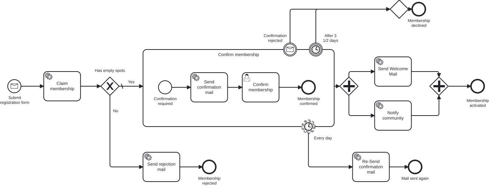

# Aufgabe 0 – Den Sollprozess fachlich modellieren

> **Voraussetzung:** Kapitel 1 – du kennst BPMN als Notation (Events, Tasks, Gateways, Subprozesse, Boundary Events).
> **Arbeitsverzeichnis:** ein beliebiger Ordner deiner Wahl (noch kein Code, noch kein Modul).
> **Neu in dieser Aufgabe:** BPMN-Modeler, der vollständige Sollprozess als gemeinsame Landkarte.

## Darum geht es

**Miravelo** ist ein Online-Shop für hochwertige Fahrräder – Gravel Bikes für lange
Wochenendtouren, Rennräder für alle, die es auf dem Asphalt schnell mögen. Die Kundschaft
ist jung, markenbewusst und ziemlich leidenschaftlich.

Miravelo baut daraus mehr als einen Verteiler: den **Inner Circle**, eine exklusive
Mitgliedschaft mit begrenzter Platzzahl. Wer beitreten will, registriert sich, bestätigt per
Double-Opt-In, bekommt einen Platz reserviert – und wird am Ende willkommen geheißen. Klingt
nach vier Kästchen, hat aber Bestätigungsfristen, eine Kapazitätsgrenze und einen Rückzieher,
wenn am Ende doch kein Platz frei ist.

> *„Zeichnen wir das doch erst mal auf, bevor jemand anfängt zu programmieren."*
> — der eine vernünftige Satz im ganzen Kickoff.

Bevor irgendetwas automatisiert wird, hältst du den **kompletten Sollprozess fachlich** fest:
Was passiert, in welcher Reihenfolge, wo wartet der Prozess, wo verzweigt er? Das ist die
Sprache, in der Fachbereich und Entwicklung sich einig werden – ohne eine Zeile Technik. Dieses
Modell ist die **Landkarte für das ganze Training**: Ab Aufgabe 1 automatisierst du es Stück für
Stück.

## Lernziele

Nach dieser Aufgabe kannst du

- einen BPMN-Modeler installieren und darin ein durchgängiges Modell anlegen,
- die Notation aus Kapitel 1 auf einen realen Geschäftsprozess anwenden – Start- und End Events,
  User Task und Service Task, Exclusive und Parallel Gateway, eingebetteter Subprozess
  und Boundary Events,
- Warte- und Verzweigungspunkte im Ablauf begründen (wo wartet der Prozess auf einen Menschen,
  wo auf eine Frist, wo entscheidet eine Bedingung),
- Elemente so benennen, dass ein Fachbereich den Ablauf ohne Rückfragen vorlesen kann.

## Ziel-Modell

Das ist der vollständige Sollprozess des Inner Circle. Er sieht groß aus – ist aber nur die
Summe vieler kleiner, dir bekannter Bausteine. Genau diesen Ablauf baust du im Lauf des
Trainings Schritt für Schritt technisch nach.

## Aufgabe

### 1. Modeler installieren

Wir arbeiten mit dem **[Miragon BPMN Modeler](https://miragon.github.io/bpmn-modeler/)**.
Es gibt ihn als VS-Code-Extension, als IntelliJ-Plugin und als eigenständige Desktop-App –
nimm die Variante, die zu deiner Umgebung passt. Lege danach ein neues BPMN-Diagramm an.

### 2. Registrierung und Kapazitätsprüfung modellieren

Beginne mit dem Rückgrat des Prozesses: Ein Interessent registriert sich, der Prozess reserviert
einen Platz und prüft dann, ob überhaupt noch einer frei ist. Ist keiner frei, endet die
Bewerbung mit einer Absage.

| Typ | Name |
|---|---|
| Start Event | Submit registration form |
| Service Task | Claim membership |
| Exclusive Gateway | Has empty spots |
| Service Task | Send rejection mail |
| End Event | Membership rejected |

Verbinde Start → *Claim membership* → *Has empty spots*. Vom Gateway führt ein Pfad **No** zu
*Send rejection mail* → *Membership rejected*. Der Pfad **Yes** bleibt zunächst offen – ihn füllst
du im nächsten Schritt. Der Platz wird also **vor** der Prüfung reserviert.

### 3. Die Bestätigung als Subprozess modellieren

Wer einen Platz bekommt, muss die Mitgliedschaft aktiv bestätigen (Double-Opt-In). Fasse diesen
Bestätigungsablauf in einem **eingebetteten Subprozess** zusammen – er bekommt gleich seine eigenen
Fristen und Ausnahmen, und ein Subprozess hält das übersichtlich.

Modelliere den Subprozess **Confirm membership** und darin:

| Typ | Name |
|---|---|
| Start Event (im Subprozess) | Confirmation required |
| Service Task | Send confirmation mail |
| User Task | Confirm membership |
| End Event (im Subprozess) | Membership confirmed |

Führe den **Yes**-Pfad des Gateways aus Schritt 2 in diesen Subprozess. An diesem *User Task*
hält der Prozess an: Hier wartet er, bis ein Mensch bestätigt.

### 4. Erinnerung, Frist und Ablehnung ergänzen

Menschen bestätigen nicht immer sofort – manche gar nicht. Häng deshalb **Boundary Events** an
den Subprozess *Confirm membership*, die drei Ausnahmen abbilden:

| Boundary Event | Typ | Name | Führt zu |
|---|---|---|---|
| Erinnerung | Timer, nicht unterbrechend, täglich | Every day | Service Task *Re-Send confirmation mail* → End Event *Mail sent again* |
| Abbruch nach Frist | Timer, unterbrechend, 3½ Tage | After 3 1/2 days | End Event *Membership declined* |
| Aktive Ablehnung | Message, unterbrechend | Confirmation rejected | End Event *Membership declined* |

Das **nicht unterbrechende** Timer-Event lässt den Subprozess weiterlaufen und schickt nebenbei
täglich eine Erinnerung. Die beiden **unterbrechenden** Events brechen die Bestätigung ab und
führen zu *Membership declined*.

### 5. Die Aktivierung parallel modellieren

Ist die Mitgliedschaft bestätigt, wird das Mitglied aktiviert – und zwei Dinge passieren
gleichzeitig: die Willkommens-Mail geht raus, und die Community wird informiert. Modelliere das
mit einem **Parallel Gateway** (Fork und Join).

| Typ | Name |
|---|---|
| Parallel Gateway (Fork) | – |
| Service Task | Send Welcome Mail |
| Service Task | Notify community |
| Parallel Gateway (Join) | – |
| End Event | Membership activated |

Führe den Ausgang des Subprozesses in den Fork, beide Service Tasks parallel, dann in den Join
und zu *Membership activated*.

### 6. Modell sichern

Speichere die Datei als `membership.bpmn` in einem Ordner deiner Wahl. Sie ist dein Referenzbild
für alle Folgeaufgaben.

## Randbedingungen

- **Nur fachlich.** Es geht um Ablauf und Benennung. Element-IDs nach Konvention, Formularfelder,
  die Anbindung von Service Tasks an Java-Code sowie `isExecutable` und `historyTimeToLive` lässt
  du hier bewusst weg – das kommt ab Aufgabe 2.
- **Das ist der Zielzustand, nicht der erste Schritt.** Niemand automatisiert diesen Prozess auf
  einmal. Ab Aufgabe 1 nimmst du dir kleine Ausschnitte vor.
- **Noch nicht ins Modul kopieren.** Unter `services/process-application/src/main/resources/bpmn/`
  liegt bereits ein bewusst rudimentäres `membership.bpmn`, das du in Aufgabe 1 brauchst.
  Überschreibe es jetzt nicht.
- Namen in den Modellen sind durchgehend englisch; die Aufgabenbeschreibungen gibt es auf
  Deutsch und Englisch.

## Erwartetes Ergebnis

Dein Modell bildet den vollständigen Ablauf ab: Registrierung, Platzreservierung, Kapazitäts-
Gateway, Bestätigungs-Subprozess mit Erinnerung, Frist und Ablehnung sowie die parallele
Aktivierung. Der Modeler meldet keine Fehler, und jemand aus dem Fachbereich könnte den Ablauf
vorlesen, ohne nachzufragen, was ein einzelnes Element bedeutet.

## Selbstcheck

- [ ] Das Modell hat genau einen Startpunkt und endet in *Membership activated*, *Membership
      rejected* oder *Membership declined*
- [ ] Die Kapazität wird über ein Exclusive Gateway mit einem **No**-Pfad zur Absage geprüft
- [ ] Die Bestätigung liegt in einem eingebetteten Subprozess mit einem User Task
- [ ] Am Subprozess hängen drei Boundary Events: täglicher (nicht unterbrechender) Timer,
      3½-Tage-Timer (unterbrechend) und ein Message Event (unterbrechend)
- [ ] Die Aktivierung läuft über ein Parallel Gateway (Willkommens-Mail und Community-Info
      gleichzeitig)
- [ ] Alle Elemente sind über Sequenzflüsse verbunden – kein loses Element
- [ ] Die Datei liegt als `membership.bpmn` gespeichert vor

## Hinweise

Lass dich von der Größe nicht abschrecken: Jeder fortgeschrittene Baustein bekommt später seine
**eigene Aufgabe**, in der du ihn technisch umsetzt – der Bestätigungsschritt in Aufgabe 3, das
Kapazitäts-Gateway in Aufgabe 4, Subprozess und Boundary Events in Aufgabe 6. Hier zeichnest du
zuerst die ganze Landkarte, damit du bei jedem Teilschritt weißt, wohin er gehört.

Warum ein User Task und ein Service Task? Der **User Task** wartet auf einen Menschen – jemand
bestätigt die Mitgliedschaft. Der **Service Task** wird von einem System erledigt – der
Mailversand, die Platzreservierung. Diese Unterscheidung legt fest, wo der Prozess wartet und wo
er von allein weiterläuft.

## Referenzlösung

`../../models/exercise-00/membership.bpmn` – öffne das Modell im Modeler und vergleiche es mit
deinem.

## Nächster Schritt

In Aufgabe 1 bringst du die Engine zum Laufen, die genau solche Modelle ausführt – zunächst mit
einem bewusst winzigen Ausschnitt.

➡️ [Weiter zu Aufgabe 1](exercise-01.md)
